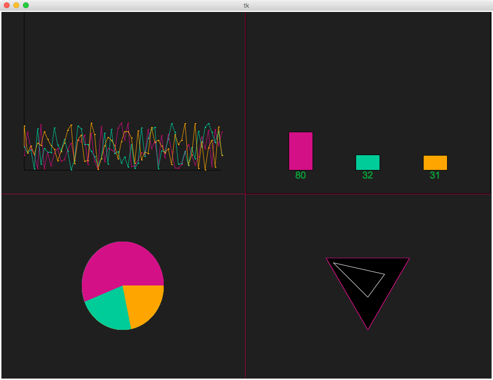

# Graph



A simple graph visualization written in [Python](https://www.python.org) using the built-in [`tkinter`](https://docs.python.org/3/library/tkinter.html) library.

## Requirements

- [Python 3](https://www.python.org) with [`tkinter`](https://docs.python.org/3/library/tkinter.html)

## Launching

To start the visualization download or clone this repository, and in the folder, you downloaded or cloned, run:

```
$ python main.py
```
